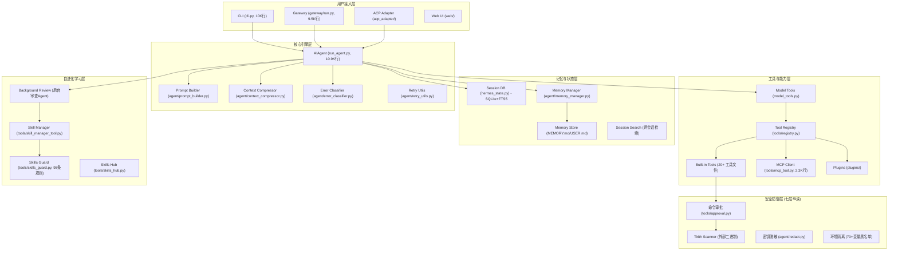

# Hermes-Agent 源码深度学习手册

> 基于 NousResearch/hermes-agent v0.9.0 源码的 Agent 开发底层技术提炼
> 
> 目标：提取可迁移的 Agent 开发核心技术，按价值排序，形成每日学习计划

---

## 一、全局架构鸟瞰

### 1.1 系统分层架构



### 1.2 项目规模

- **总 Python 文件**: 870 个
- **总代码行数**: ~400,000 行
- **第三方依赖**: 16 核心 + 20+ 可选
- **支持平台**: 20+ 消息平台
- **支持 LLM 提供商**: 20+ （OpenRouter, Anthropic, Google, GLM, Kimi 等）

### 1.3 核心文件地图

| 文件 | 行数 | 职责 | 复杂度 |
|------|------|------|--------|
| `run_agent.py` | 10,896 | Agent 主循环、API调用、错误恢复、工具调度、后台审查 | ⭐⭐⭐⭐⭐ |
| `cli.py` | 10,036 | 交互式 CLI (prompt_toolkit REPL) | ⭐⭐⭐⭐ |
| `gateway/run.py` | 9,551 | 多平台网关主控、会话管理、Agent缓存 | ⭐⭐⭐⭐ |
| `model_tools.py` | 600 | 工具发现与调度编排层 | ⭐⭐⭐ |
| `tools/registry.py` | ~400 | 工具注册表（单例、线程安全） | ⭐⭐⭐ |
| `tools/mcp_tool.py` | 2,273 | MCP 客户端完整实现（两种传输+安全） | ⭐⭐⭐⭐ |
| `hermes_state.py` | 1,238 | SQLite 会话存储 + FTS5 全文检索 + WAL | ⭐⭐⭐ |
| `agent/context_compressor.py` | 821 | 上下文五步压缩算法 | ⭐⭐⭐⭐ |
| `agent/error_classifier.py` | 821 | API 错误六级分类与恢复策略 | ⭐⭐⭐ |
| `agent/prompt_builder.py` | 1,044 | 系统提示词 12 层动态组装 | ⭐⭐⭐⭐ |
| `tools/approval.py` | 926 | 危险命令审批（40+ 正则 + 3 种模式） | ⭐⭐⭐ |
| `tools/skills_guard.py` | ~800 | 技能安全扫描（98条规则 + 结构检查） | ⭐⭐⭐ |
| `tools/skill_manager_tool.py` | ~700 | 技能 CRUD + 验证管线 + 模糊补丁 | ⭐⭐⭐ |
| `toolsets.py` | 702 | 工具集定义、递归解析、平台预设 | ⭐⭐ |
| `agent/redact.py` | ~300 | 30+ API key 前缀匹配 + PEM/DB URL 脱敏 | ⭐⭐⭐ |

### 1.4 完整数据流

```
用户输入 → [平台适配器 → MessageEvent 标准化] → [会话管理(SQLite)]
    → [系统提示词 12 层组装] → [上下文压缩检查(50%阈值)]
    → [LLM API 调用(含:流式/非流式, 3次重试, 凭证轮换, 备用模型)]
    → [多提供商响应规范化(3种API模式)]
    → [工具调用判断]
        → YES: [并行/串行调度] → [安全审批(40+模式)] → [执行] → [结果大小限制] → 回到 LLM
        → NO: [最终响应] → [后台审查(记忆nudge+技能nudge)] → [平台格式化+媒体处理] → 用户
```

---

## 二、Top 10 可迁移 Agent 底层技术（按价值排序）

### 🏆 #1 Tool-Calling Loop（工具调用主循环）⭐⭐⭐⭐⭐

**核心文件**: `run_agent.py:8092-10472`

Agent 的心脏：一个 while 循环，每次迭代要么产生工具调用（continue），要么产生最终响应（break）。

**关键设计**：
- `IterationBudget` 跨父子 Agent 共享（`threading.Lock` 保护），防止子 Agent 无限递归
- `_budget_grace_call`：预算耗尽时允许最后一次无工具调用，优雅总结
- `_sanitize_api_messages()` 每次 API 调用前修复孤立的 tool_call/tool_result 对
- 支持并行工具调用：`_should_parallelize_tool_batch()` 判断，`ThreadPoolExecutor` 最多 8 并发

**精华代码模式**：
```python
while (api_call_count < max_iterations and budget.remaining > 0):
    api_messages = prepare_messages(messages)  # 注入临时上下文、清理孤立对
    response = call_llm(api_messages, tools)   # 含重试/降级/凭证轮换
    normalized = normalize_response(response)  # 多提供商格式统一
    if normalized.tool_calls:
        results = execute_tools(normalized.tool_calls)  # 并行/串行
        messages.extend(results)
        continue
    else:
        return normalized.content  # 最终响应
```

---

### 🏆 #2 Self-Registering Tool System（自注册工具系统）⭐⭐⭐⭐⭐

**核心文件**: `tools/registry.py`, `model_tools.py`, `toolsets.py`

**设计理念**：工具在导入时自注册到全局单例注册表，零配置文件。每个工具文件底部调用 `registry.register()`。

**关键设计**：
- `ToolEntry` 包含：name, toolset, schema(OpenAI格式), handler, check_fn, is_async, emoji
- 线程安全的 `ToolRegistry` 单例（`threading.RLock` + snapshot 模式读时复制）
- `check_fn` 延迟检查：不阻塞注册，仅在 `get_definitions()` 时过滤不可用工具
- 防影子注册：同名不同 toolset 拒绝（MCP-to-MCP 除外）
- `dispatch()` 自动桥接 async handler（`_run_async()`）
- `toolset` 支持递归包含和平台预设（`hermes-cli`, `hermes-telegram` 等）

**添加新工具只需 3 步**：
1. `tools/your_tool.py` — 定义 handler + schema + `registry.register()`
2. `toolsets.py` — 添加到对应工具集
3. `model_tools.py` — 添加到 `_modules` 列表

---

### 🏆 #3 Context Compression（上下文五步压缩）⭐⭐⭐⭐⭐

**核心文件**: `agent/context_compressor.py`, `agent/context_engine.py`

**五步压缩算法**：
1. **预处理**：裁剪 >200 字符的旧工具输出为占位符（零 LLM 成本）
2. **保护首部**：系统提示 + 前 3 条消息不可压缩（prefix cache 锚点）
3. **保护尾部**：从末尾向前累积至 `tail_token_budget`（上下文 × 20%，最少 3 条）
4. **摘要中间**：结构化 LLM 提示生成 10 维度摘要（目标/约束/进度/决策/文件/剩余工作等）
5. **迭代更新**：再次压缩时更新已有摘要而非重新生成

**关键参数**：
- 触发阈值 = 上下文窗口 50%（留余量给工具输出）
- 摘要预算 = 被压缩内容的 20%，上限 12,000 token
- 摘要前缀 `[CONTEXT COMPACTION — REFERENCE ONLY]` 防止 LLM 重做旧工作

---

### 🏆 #4 Error Classification & Recovery Chain（错误分类与恢复链）⭐⭐⭐⭐⭐

**核心文件**: `agent/error_classifier.py`, `agent/retry_utils.py`, `agent/credential_pool.py`

**结构化分类**：
```python
ClassifiedError → FailoverReason (11种) + retryable + should_compress 
                 + should_rotate_credential + should_fallback
```

**六级分类管线**（优先级递降）：
1. 提供商特定模式（Anthropic thinking 签名错误等）
2. HTTP 状态码（401/402/429/413/5xx 等）
3. 响应体 error code
4. 错误消息正则匹配
5. 服务器断连 + 大会话启发式
6. 传输层错误（timeout、connection reset）

**分层恢复策略**：
```
错误 → 分类 → [凭证轮换(CredentialPool)] → [上下文压缩(最多3次)]
     → [备用模型切换] → [去相关抖动退避重试(5s基数/120s上限/50%抖动)]
```

**精妙之处**：可中断睡眠（0.2s 粒度轮询中断信号），UnicodeEncodeError 特殊处理（先剥离 surrogate，再降级 ASCII-only）

---

### 🏆 #5 Self-Evolution Learning Loop（自进化学习闭环）⭐⭐⭐⭐⭐

**核心文件**: `run_agent.py:2145-2268`, `tools/skill_manager_tool.py`, `tools/skills_guard.py`

**三层驱动**：
1. **System Prompt 植入**：`SKILLS_GUIDANCE` 显式指导 Agent 在复杂任务后创建/更新技能
2. **迭代计数器**：`_iters_since_skill >= creation_nudge_interval(默认15)`
3. **后台 Agent Fork**：`_spawn_background_review()` 创建独立审查 Agent

**后台审查机制**（run_agent.py:2169）：
```python
def _spawn_background_review(messages_snapshot, review_memory, review_skills):
    review_agent = AIAgent(same_model, max_iterations=8, quiet=True)
    review_agent._memory_store = self._memory_store  # 共享写入
    review_agent._skill_nudge_interval = 0           # 防无限递归
    # 注入审查提示词 → 审查Agent分析对话 → 决定创建/更新技能
    # → skills_guard 安全扫描 → 写入 ~/.hermes/skills/ → 缓存失效
```

**审查提示词核心**（精心设计）：
> Focus on: was a non-trivial approach used that required trial and error, or changing course due to experiential findings?

不是记录"做了什么"，而是"**为什么这样做**"和"**踩了什么坑**"。

**质量门控**：技能创建后自动经过 98 条正则安全扫描 + 结构验证 + 信任等级策略。agent-created 技能：safe→allow, caution→allow, dangerous→block。

---

### 🏆 #6 Multi-Layer System Prompt Assembly（12层系统提示词）⭐⭐⭐⭐

**核心文件**: `agent/prompt_builder.py`, `run_agent.py:3121`

**12 层组装顺序**：
```
1. 身份认知 (SOUL.md / DEFAULT_AGENT_IDENTITY)
2. 工具使用指导 (memory, session_search, skills)
3. 订阅能力提示 (Nous subscription)
4. 工具调用强制指令 (仅对 GPT/Gemini/Codex 模型注入)
5. 模型特定指导 (Google/OpenAI 特殊规则)
6. 用户自定义系统消息
7. 持久记忆快照 (MEMORY.md — 冻结不变)
8. 用户画像快照 (USER.md — 冻结不变)
9. 技能索引 (所有技能的 name+description, 两层缓存)
10. 上下文文件 (.hermes.md > AGENTS.md > CLAUDE.md > .cursorrules)
11. 时间戳 + 会话 ID + 模型名称
12. 平台提示 (Telegram/Discord/Slack 差异化行为指导)
```

**安全扫描**：`_scan_context_content()` 检查 10 种 prompt injection 模式 + 17 种不可见 Unicode 字符。被阻止的文件显示 `[BLOCKED: contained potential prompt injection]`。

---

### 🏆 #7 Multi-Provider LLM Abstraction（多提供商统一抽象）⭐⭐⭐⭐

**核心文件**: `run_agent.py:_build_api_kwargs()`, `agent/anthropic_adapter.py`, `agent/credential_pool.py`

**三种 API 模式**：chat_completions (OpenAI格式), codex_responses (Codex API), anthropic_messages (Anthropic 原生)

**响应规范化**：所有提供商返回统一规范化为 `{role, content, tool_calls, reasoning}`

**凭证池 + 备用模型链**：多 API key 轮换 → 某 key 429 时自动切换 → 仍失败则切备用模型

**Smart Model Routing**（agent/smart_model_routing.py）：简单问题用便宜模型，复杂问题用贵模型

---

### 🏆 #8 Persistent Memory with Frozen Snapshots（冻结快照式持久记忆）⭐⭐⭐⭐

**核心文件**: `tools/memory_tool.py`, `hermes_state.py`, `agent/memory_manager.py`

**双存储设计**：MEMORY.md（~800 token, Agent笔记）+ USER.md（~500 token, 用户画像）

**冻结快照机制**：
```
会话开始 → load_from_disk() → 快照注入系统提示词（不再更新，保护 prefix cache）
mid-session → memory tool 写磁盘 → 系统提示词不变
工具响应 → 返回磁盘最新状态（Agent 看到最新的）
```

**SQLite 会话存储**：sessions + messages 两表，WAL 并发模式，FTS5 全文检索，parent_session_id 支持会话链

**安全写入**：`fcntl.flock` 文件锁 → `tempfile.mkstemp` 原子写入 → 写前重读磁盘 → 内容安全扫描

**8 个可插拔记忆插件**：Honcho, Holographic, Mem0, Hindsight, Supermemory, RetainDB, ByteRover, OpenViking

---

### 🏆 #9 Multi-Platform Gateway Adapter（20+ 平台网关）⭐⭐⭐⭐

**核心文件**: `gateway/platforms/base.py`, `gateway/session.py`, `gateway/run.py`

**最小适配器接口**：`connect()`, `disconnect()`, `send()`, `get_chat_info()` — 4 个抽象方法

**20+ 平台**：Telegram, Discord, Slack, WhatsApp, Signal, Matrix, DingTalk, Feishu, WeCom, WeXin, Email, SMS, BlueBubbles, QQ, Home Assistant, Mattermost, Webhook, API Server

**消息标准化**：所有入站统一为 `MessageEvent`(text, message_type, source, media_urls, ...)

**会话隔离**：
- DM: `agent:main:telegram:dm:<chat_id>`
- 群组: 默认每用户独立会话
- 线程: 共享会话（Forum UX）
- `contextvars.ContextVar` 替代 `os.environ`（asyncio 任务级隔离）

**Agent 缓存**：per-session `AIAgent` 实例缓存，保护 LLM prefix cache 跨对话回合

---

### 🏆 #10 Defense-in-Depth Security（七层纵深安全）⭐⭐⭐⭐

**七层防御体系**：

| 层 | 机制 | 核心文件 | 失败模式 |
|---|---|---|---|
| 输入验证 | ANSI剥离+Unicode NFKC+prompt injection扫描 | `approval.py`, `prompt_builder.py` | 静默拒绝 |
| 命令审批 | 40+危险模式正则+Tirith二进制扫描+3种模式(manual/smart/off) | `approval.py`, `tirith_security.py` | 人工确认 |
| SSRF防护 | DNS解析+私有IP段阻止+云元数据+CGNAT | `url_safety.py` | 拒绝请求 |
| 环境隔离 | 70+环境变量黑名单(本地)+白名单(MCP/sandbox) | `environments/local.py`, `mcp_tool.py` | 变量不传递 |
| 密钥脱敏 | 30+API key前缀+PEM/DB URL/Bearer(导入时快照锁定) | `redact.py` | 自动替换 |
| 容器加固 | `--cap-drop ALL`+PID限制256+no-new-privileges+noexec tmpfs | `environments/docker.py` | 操作被拒 |
| 技能扫描 | 98条威胁模式(12类)+50文件/1MB上限+symlink检测+信任等级 | `skills_guard.py` | 阻止安装 |

---

## 三、架构决策对照表

| 设计决策 | Hermes 的做法 | 常见替代方案 | 优劣分析 |
|---------|-------------|------------|---------|
| 主循环架构 | 同步 while + ThreadPool 并行工具 | 纯 async (LangChain) | 同步更简单可靠，适合单用户CLI；async 更适合网关高并发 |
| 工具注册 | Import-time 自注册到单例 | 配置文件声明 / 装饰器 | 自注册零配置；但有隐式导入顺序依赖 |
| 上下文管理 | LLM 摘要压缩中间回合 | 滑动窗口丢弃 / 向量检索(MemGPT) | 摘要保留更多语义；但有额外 API 成本 |
| 记忆存储 | Markdown 文件 + SQLite FTS5 | 向量数据库(Pinecone) / 图数据库 | 简单零依赖；不适合大规模语义检索 |
| 学习闭环 | 后台 fork Agent 自审 | 人工策展 / 离线 fine-tune | 完全自主无感知；质量依赖审查提示词 |
| 多提供商 | 三种 API 模式 + 响应规范化 | litellm 统一代理 | 自控力更强；litellm 更省代码 |
| 安全模型 | 正则黑名单 + 外部扫描器 | LLM 判断 / 白名单执行 | 正则快速确定性；可能漏判复杂场景 |
| 网关架构 | 抽象基类 + 条件实例化 | 消息队列解耦 / 微服务 | 单进程简单部署；不适合极高并发 |
| 提示词缓存 | 冻结快照 + cache_control 断点 | 每轮重建 | 节省 75% 输入成本；牺牲 mid-session 记忆更新 |

---

## 四、Anti-Patterns & 改进建议

### 4.1 存在的不足

1. **run_agent.py 过度膨胀**（10,896行）：主循环、错误处理、压缩、会话管理、后台审查全在一个文件。应拆分为 `agent_loop.py`、`api_client.py`、`session_manager.py` 等。

2. **同步阻塞架构**：核心循环同步执行，API 调用通过 `threading.Thread` 桥接。Gateway 高并发场景原生 async 更合适。

3. **硬编码工具发现**：`model_tools._discover_tools()` 的模块列表硬编码，添加新工具需改这个列表。可改为 `entry_points` 或目录扫描。

4. **安全规则维护成本高**：98 条正则需持续更新，容易漏判新攻击模式。可考虑结合 LLM 辅助判断做二次确认。

5. **记忆容量极小**（~1,300 token）：长期助手场景太有限。可考虑分层记忆（热 markdown / 温 SQLite / 冷 向量检索）。

### 4.2 如果我来重构

- 将 `run_agent.py` 拆成 5-6 个模块，核心循环 < 500 行
- 用 `importlib.metadata.entry_points` 实现插件式工具发现
- 记忆系统增加 embedding-based RAG 的温层
- 安全扫描增加 LLM 辅助判断层

---

## 五、可直接复用的独立模块

| 模块 | 文件 | 行数 | 独立性 | 外部依赖 |
|------|------|------|--------|----------|
| 退避算法 | `agent/retry_utils.py` | 57 | ⭐⭐⭐⭐⭐ | 零（纯数学） |
| 路径安全 | `tools/path_security.py` | ~20 | ⭐⭐⭐⭐⭐ | 零（stdlib） |
| ANSI 剥离 | `tools/ansi_strip.py` | ~50 | ⭐⭐⭐⭐⭐ | 零（纯正则） |
| 工具注册表 | `tools/registry.py` | ~400 | ⭐⭐⭐⭐⭐ | 零（stdlib） |
| 错误分类器 | `agent/error_classifier.py` | 821 | ⭐⭐⭐⭐ | openai/anthropic SDK |
| 密钥脱敏 | `agent/redact.py` | ~300 | ⭐⭐⭐⭐ | 零（纯正则） |
| URL 安全 | `tools/url_safety.py` | ~100 | ⭐⭐⭐⭐ | 零（stdlib socket） |
| 危险命令检测 | `tools/approval.py`(patterns) | ~200 | ⭐⭐⭐⭐ | 零（纯正则） |
| 上下文压缩器 | `agent/context_compressor.py` | 821 | ⭐⭐⭐ | 需 LLM API |
| FTS5 会话搜索 | `hermes_state.py` | 1,238 | ⭐⭐⭐ | SQLite (stdlib) |

---

## 六、14天每日学习计划

### 层级说明

| 层级 | 定义 | 天数 |
|------|------|------|
| **T0 — 基石** | 不掌握就无法构建任何 Agent | Day 1-4 |
| **T1 — 生产级** | 从 Demo 到可用产品的关键 | Day 5-8 |
| **T2 — 创新** | 让 Agent 具备自进化能力 | Day 9-10 |
| **T3 — 工程化** | 多平台、规模化扩展 | Day 11-14 |

---

### 📅 Day 1：工具注册系统（T0 — 基础中的基础）

**学习目标**：理解 Agent 工具系统的核心设计模式

**阅读清单**：
- [ ] `tools/registry.py` 全文（~400行）— ToolEntry, ToolRegistry, register/dispatch
- [ ] `model_tools.py`（~600行）— _discover_tools(), get_tool_definitions(), handle_function_call()
- [ ] `toolsets.py`（~700行）— toolset 递归解析、平台预设
- [ ] `tools/todo_tool.py` — 一个简单工具的完整注册链路

**关键洞察**：
- 注册表是 `threading.RLock()` 保护的单例，snapshot 模式读时复制
- `check_fn` 延迟检查让工具按运行时条件动态启用/禁用
- 所有工具 handler 必须返回 JSON 字符串，统一错误格式 `{"error": "..."}`

**动手**：写一个 50 行的 ToolRegistry，支持 register/get_schemas/dispatch，创建 3 个自注册工具

---

### 📅 Day 2：Tool-Calling 主循环（T0 — Agent 的心脏）

**学习目标**：理解 Agent 主循环的完整执行流程

**阅读清单**：
- [ ] `run_agent.py` L7770-8090（`run_conversation()` 初始化段）
- [ ] `run_agent.py` L8092-8319（while 主循环 + 消息准备）
- [ ] `run_agent.py` L8319-9690（内层 API 调用重试循环）
- [ ] `run_agent.py` L9690-10472（响应处理 + 工具调度 + 后处理）
- [ ] `run_agent.py` L7700-7745（IterationBudget 类）
- [ ] `run_agent.py` L3302（_sanitize_api_messages 孤立对修复）

**关键洞察**：
- IterationBudget 跨父子 Agent 共享，防止嵌套耗尽
- Grace Call 让 Agent 在预算用完时优雅总结
- 并行工具调度：`_should_parallelize_tool_batch()` 按路径依赖分析

**动手**：画一张完整流程图（Mermaid），能向别人解释每一步

---

### 📅 Day 3：错误分类与恢复（T0 — 生产级必备）

**学习目标**：掌握 LLM API 错误处理的工程实践

**阅读清单**：
- [ ] `agent/error_classifier.py` 全文（821行）— FailoverReason, classify_api_error()
- [ ] `agent/retry_utils.py` 全文（57行）— jittered_backoff()
- [ ] `agent/credential_pool.py` — 多 key 轮换
- [ ] `run_agent.py` L8319-8600（内层重试循环各分支恢复策略）

**关键洞察**：
- 六级分类管线，结构化恢复建议（retryable + should_compress + should_fallback）
- 去相关抖动退避避免雷群效应
- 凭证池 + 备用模型链大幅提升可用性

**动手**：实现 `ErrorClassifier` + `jittered_backoff` + 重试循环骨架

---

### 📅 Day 4：上下文压缩（T0 — 长对话的生命线）

**学习目标**：掌握 LLM 上下文窗口管理

**阅读清单**：
- [ ] `agent/context_engine.py`（185行）— 插件化上下文引擎接口
- [ ] `agent/context_compressor.py` 全文（821行）— 五步压缩算法
- [ ] `run_agent.py` L6754（_compress_context 调用链）
- [ ] `agent/manual_compression_feedback.py` — 手动 /compact 的用户反馈

**关键洞察**：
- 触发阈值 50%（留余量）；摘要预算 = 被压缩内容 20%，上限 12K token
- 结构化 10 维度摘要比自由摘要效果更好
- 迭代更新（更新已有摘要而非重建）节省 API 成本
- 摘要用"前任助手交接"框架，防止 LLM 重做旧工作

**动手**：实现最小化"保护首尾+摘要中间"压缩器

---

### 📅 Day 5：系统提示词 12 层组装（T1）

**学习目标**：掌握复杂系统提示词的动态组装

**阅读清单**：
- [ ] `agent/prompt_builder.py` 全文（1044行）— 12 层组装 + 安全扫描 + 缓存
- [ ] `run_agent.py` L3121（_build_system_prompt() 入口）
- [ ] `agent/skill_commands.py` — 技能到 slash command 的映射
- [ ] `agent/subdirectory_hints.py` — 子目录 AGENTS.md 注入

**关键洞察**：
- 条件注入（只在工具可用时注入对应 guidance）
- 冻结快照保护 prefix cache
- 模型特异性补丁（GPT/Gemini/Google 各有弱点）
- 技能索引两层缓存（进程 LRU + 磁盘快照）

**动手**：设计通用的多层提示词组装框架（身份/能力/记忆/上下文/环境层）

---

### 📅 Day 6：记忆系统（T1 — 有状态 Agent 基础）

**学习目标**：理解 Agent 记忆的存储、检索和生命周期

**阅读清单**：
- [ ] `tools/memory_tool.py` 全文 — MEMORY.md/USER.md 的格式和 CRUD 操作
- [ ] `hermes_state.py` 全文（1238行）— SQLite schema(v6), WAL, FTS5, 并发控制
- [ ] `agent/memory_manager.py` — 多记忆提供者编排
- [ ] `agent/memory_provider.py` — 插件式记忆提供者接口

**关键洞察**：
- 冻结快照 + 原子写入 + 文件锁 + 内容安全扫描
- FTS5 全文检索支持关键词/短语/布尔/前缀匹配
- WAL 模式 + 应用层重试（随机抖动 20-150ms，最多 15 次）

**动手**：实现 MemoryStore（冻结快照式）+ SessionDB（SQLite WAL + FTS5）

---

### 📅 Day 7：安全防御体系（上）— 命令审批与输入过滤（T1）

**学习目标**：掌握 Agent 执行层的安全设计

**阅读清单**：
- [ ] `tools/approval.py` 全文（926行）— 40+ 危险模式 + 3 种审批模式 + 会话级状态
- [ ] `tools/tirith_security.py` — 外部扫描器集成 + SHA256 校验 + cosign 供应链验证
- [ ] `agent/redact.py` — 30+ API key 前缀 + PEM/DB URL/Bearer 脱敏
- [ ] `tools/url_safety.py` — SSRF 防护（DNS 解析 + IP 段阻止）
- [ ] `tools/environments/local.py` — 70+ 环境变量黑名单

**关键洞察**：
- 命令规范化**在模式匹配之前**（ANSI 剥离 + NFKC + null 字节移除）
- 脱敏模块在**导入时快照锁定**，LLM 代码无法运行时禁用
- 工作目录用字符**白名单**（非黑名单）验证

**动手**：实现危险命令检测（30 条正则）+ 密钥脱敏 + SSRF 防护

---

### 📅 Day 8：安全防御体系（下）— 技能扫描与环境隔离（T1）

**学习目标**：掌握 Agent 自生成内容的安全门控

**阅读清单**：
- [ ] `tools/skills_guard.py`（~800行）— 98 条威胁模式(12类) + 结构检查 + 信任策略
- [ ] `tools/path_security.py` — 目录遍历防护（resolve + relative_to）
- [ ] `agent/context_references.py` L21-37 — 敏感路径阻止列表
- [ ] `tools/environments/docker.py` L128-145 — 容器加固参数
- [ ] `tools/code_execution_tool.py` L56-64 — 沙箱 7 白名单工具 + 限制

**关键洞察**：
- 12 类威胁模式覆盖：外泄、注入、破坏、持久化、网络、混淆、执行、遍历、挖矿、供应链、提权、凭证
- 17 种不可见 Unicode 字符检测（零宽、双向覆盖）
- 信任等级策略：builtin/trusted/community/agent-created 四级区分

**动手**：实现安全扫描器（正则威胁 + Unicode 检测 + 结构检查）

---

### 📅 Day 9：自进化学习闭环（T2 — 核心创新）

**学习目标**：理解 Agent "越用越聪明"的完整机制

**阅读清单**：
- [ ] `tools/skill_manager_tool.py`（~700行）— 技能 CRUD + 验证管线 + 模糊补丁
- [ ] `tools/skills_tool.py`（~1419行）— 三级渐进式信息披露(list→view→file)
- [ ] `run_agent.py` L2145-2268 — `_spawn_background_review()` + 三个审查提示词
- [ ] `agent/skill_utils.py` — 前置元数据解析 + 条件激活规则
- [ ] `tools/skills_sync.py` — 内置技能同步（MD5哈希检测用户修改）

**关键洞察**：
- 计数器阈值平衡学习频率与资源消耗
- 审查 Agent 禁用自身 nudge（防无限递归）+ 共享 memory_store
- 技能模糊补丁（`tools.fuzzy_match`）容忍 LLM 格式偏差

**动手**：设计"任务执行→经验提取→技能存储→下次复用"的最小学习闭环

---

### 📅 Day 10：MCP 客户端实现（T2）

**学习目标**：理解 Model Context Protocol 的完整集成

**阅读清单**：
- [ ] `tools/mcp_tool.py` 全文（2273行）— 重点理解：
  - Stdio + HTTP/StreamableHTTP 双传输
  - 后台事件循环(`_mcp_loop`) + 长连接 `MCPServerTask`
  - `notifications/tools/list_changed` 动态工具刷新
  - Sampling 机制（服务端发起 LLM 请求）
  - 安全（安全环境过滤 + 凭证脱敏 + injection 扫描 + OSV 恶意软件检查）
  - 指数退避重连（初始3次 + 断连5次）
- [ ] `tools/osv_check.py` — Google OSV API 恶意软件检测
- [ ] `mcp_serve.py`（867行）— Hermes 作为 MCP 服务端的实现

**动手**：理解完整 MCP 工作流，能向他人解释架构选型

---

### 📅 Day 11：多平台网关适配器（T3）

**学习目标**：掌握多平台消息网关的设计模式

**阅读清单**：
- [ ] `gateway/platforms/base.py` — BasePlatformAdapter 接口 + MessageEvent 格式
- [ ] `gateway/platforms/telegram.py` 或 `discord.py`（选一）— 具体适配器实现
- [ ] `gateway/session.py` — 会话 key 构建、重置策略、并发安全
- [ ] `gateway/session_context.py` — `contextvars` 任务级隔离
- [ ] `gateway/delivery.py` — 跨平台消息路由（origin/local/platform:chat_id）
- [ ] `gateway/config.py` — 重置策略（daily/idle/both/none）

**动手**：设计支持 2 个平台的最小网关框架

---

### 📅 Day 12：多提供商 LLM 适配（T3）

**学习目标**：掌握多 LLM 提供商的统一抽象

**阅读清单**：
- [ ] `run_agent.py` `_build_api_kwargs()` — 三种 API 模式参数构建
- [ ] `agent/anthropic_adapter.py` — Anthropic 特有消息格式转换
- [ ] `agent/model_metadata.py` — 模型元数据（上下文长度、能力标记）
- [ ] `agent/smart_model_routing.py` — 简单→便宜/复杂→贵 的路由策略
- [ ] `agent/prompt_caching.py` — Anthropic prefix cache 断点注入策略

**动手**：理解多提供商统一抽象的核心挑战和解决方案

---

### 📅 Day 13：RL 训练环境与评估（T3）

**学习目标**：理解 Agent 的 RL 训练和评估框架

**阅读清单**：
- [ ] `environments/agent_loop.py`（535行）— 简化版 async Agent 循环（无重试/无流式/无降级）
- [ ] `environments/hermes_base_env.py` — RL 环境基类
- [ ] `environments/tool_context.py` — 工具上下文的 task_id 隔离
- [ ] `environments/tool_call_parsers/hermes.py` — Hermes 格式工具调用解析
- [ ] `trajectory_compressor.py`（1462行）— 训练数据后处理压缩（HuggingFace tokenizer 精确计数）

**动手**：理解如何为 Agent 设计 RL 训练环境和奖励函数

---

### 📅 Day 14：综合实战 + 知识沉淀

**学习目标**：综合所有知识，设计自己的 Agent 架构

**学习内容**：
- [ ] 回顾 13 天笔记，提炼 10 个最重要的设计决策
- [ ] 阅读 `AGENTS.md`（471行）— 开发者指南和已知陷阱
- [ ] 浏览核心测试（`tests/run_agent/`, `tests/tools/`, `tests/agent/`）— 理解测试策略
- [ ] 设计你自己的 Agent 架构骨架图

**产出**：
1. "我的 Agent 架构设计文档"
2. 最小化 Agent 原型（工具注册 → 主循环 → 错误恢复 → 上下文压缩 → 记忆 → 学习闭环）

---

## 七、技术迁移评估总表

| 技术 | 迁移成本 | 外部依赖 | 适用场景 |
|------|----------|----------|----------|
| Tool-Calling 主循环 | 零 | 仅 OpenAI SDK | **所有** Agent 项目 |
| 自注册工具系统 | 零 | 纯 Python stdlib | **所有** Agent 项目 |
| 错误分类与恢复链 | 零 | 纯 Python | 需调用 LLM API 的所有项目 |
| 上下文压缩 | 低 | 需一个廉价 LLM | 需长对话的 Agent |
| Prompt 动态组装 | 零 | 纯字符串操作 | 需复杂提示词的 Agent |
| 冻结快照记忆 | 零 | stdlib (sqlite3) | 需跨会话状态的 Agent |
| 危险命令检测 | 零 | 纯正则 | 有终端执行能力的 Agent |
| 密钥脱敏 | 零 | 纯正则 | **所有**处理 API key 的项目 |
| 后台审查学习闭环 | 低 | 需 threading + Agent 实例化 | 需持续改进的 Agent |
| 多平台网关 | 中 | 平台 SDK | 需多端部署的 Agent |
| MCP 客户端 | 中 | mcp SDK | 需扩展工具生态的 Agent |
| 去相关抖动退避 | 零 | 纯数学(57行) | **所有**有重试逻辑的项目 |

---

> **核心结论**：Day 1-4 的技术是构建**任何** Agent 的底层能力，Day 5-8 是**生产化**的关键，Day 9 的自学习闭环是**最具差异化价值**的技术——目前 LangChain/CrewAI/AutoGen 都没有内置。先把 T0 打扎实，再逐层叠加。

---

*Generated from hermes-agent v0.9.0 source code analysis, 2026-04-14*
